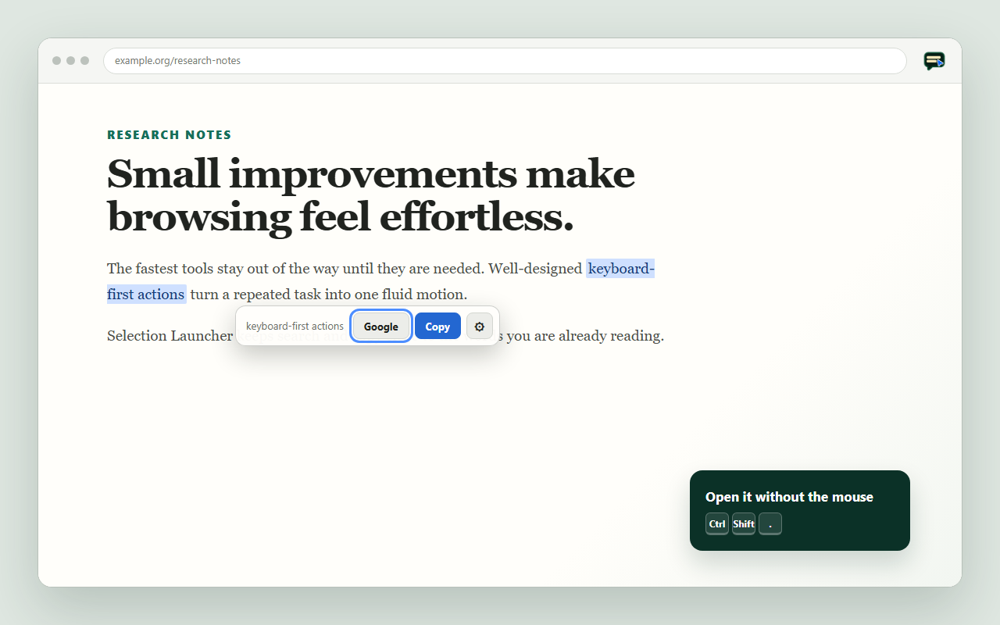
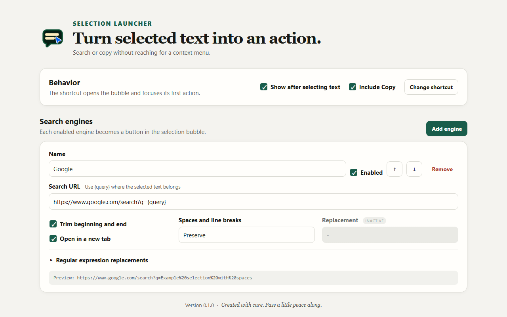

# Selection Launcher

A keyboard-first Chrome extension for acting on selected text. Select text on a page, then search with a configurable engine or copy it without opening the context menu.

See [CHANGELOG.md](CHANGELOG.md) for features and fixes included in each release.

## Screenshots

### Selection actions



### Configurable search engines



## Install locally

1. Open `chrome://extensions` in Chrome, Edge, Brave, or another Chromium browser.
2. Turn on **Developer mode**.
3. Choose **Load unpacked** and select this folder.
4. Select some text on a normal web page. The action bubble appears automatically.
5. Press **Ctrl+Shift+.** (or **Command+Shift+.** on macOS) to open and focus the bubble from the keyboard.

Chrome does not allow extensions to run on browser-owned pages such as `chrome://extensions` or the Chrome Web Store.

## Keyboard use

- **Ctrl/Command+Shift+.**: open the selection actions and focus the first button.
- **Arrow keys**: move between actions.
- **Enter** or **Space**: run the focused action.
- **Home / End**: jump to the first / last action.
- **Escape**: dismiss the bubble.

Change the shortcut at `chrome://extensions/shortcuts`. If Chrome reports a collision with another extension or browser command, assign another combination there.

## Search engine configuration

Click the extension toolbar icon to open Settings. Every enabled engine gets its own bubble button. A search URL must use `{query}`, for example:

```text
https://www.google.com/search?q={query}
```

Transforms are configured per engine and run in this order:

1. Trim leading and trailing whitespace.
2. Preserve, remove, or replace runs of whitespace.
3. Apply regular-expression replacements in their displayed order.
4. URL-encode the result and substitute it for `{query}`.

Settings sync through the browser's extension storage when browser sync is available.
The settings page saves changes automatically, confirms them with a brief notification, and clearly disables the whitespace replacement field until that transformation is selected.

## Development

See [docs/DEVELOPERS.md](docs/DEVELOPERS.md) for the required host software, test commands, development checks, and release build command.

## Project provenance

Selection Launcher was created with assistance from OpenAI Codex. Its code, behavior, and release artifacts are reviewed and tested by a human maintainer before publication.

## License

Selection Launcher is available under the [MIT License](LICENSE). You may use, copy, modify, and redistribute it, including commercially, provided the copyright and license notice remain with copies or substantial portions of the software.

## Project structure

- `manifest.json` — Manifest V3 entry point and default command.
- `LICENSE` — MIT terms for using and redistributing the project.
- `CHANGELOG.md` — categorized features and updates for every release.
- `AGENTS.md` — persistent project instructions for coding agents.
- `docs/DEVELOPERS.md` — development prerequisites and test instructions.
- `docs/STORE_LISTING.md` — reusable Chrome and Edge store copy.
- `docs/store-assets/` — store icon artwork and screenshots.
- `scripts/build.mjs` — dependency-free release ZIP builder.
- `scripts/publish.mjs` — semantic-version bump and GitHub release automation.
- `src/background.js` — shortcut routing and safe tab opening.
- `src/content.js` — selection detection and accessible action bubble.
- `src/shared.js` — configuration normalization and transform pipeline.
- `src/options.html`, `src/options.css`, `src/options.js` — engine and behavior settings.
- `src/assets/icons/` — packaged extension icons.
- `tests/` — transform and URL-safety tests.
